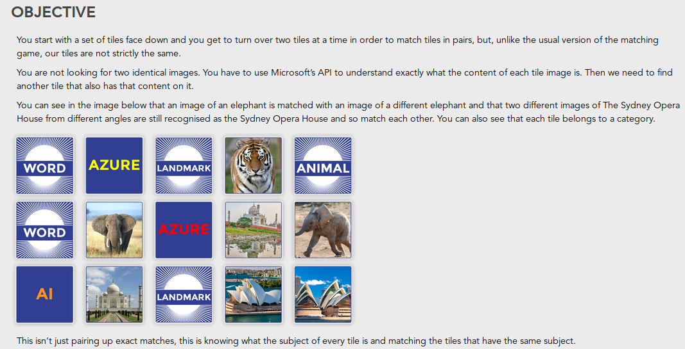
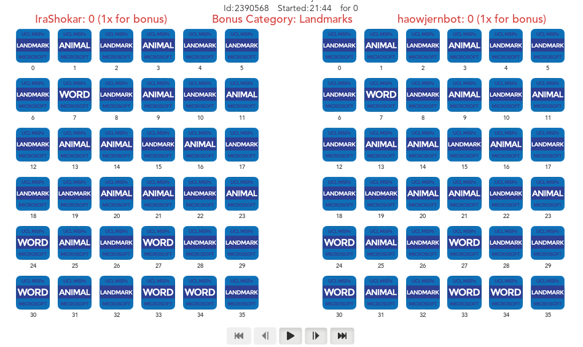

# Microsoft_AI_Mini_Hackathon
This is a simple bot playing Matching Cards game built using using the Microsoft Cognitive Services API (analyzed vision and optical character recognition) and built on a template provided by AI Gaming organisation. 

Microsoft Cognitive Services API used:https://docs.microsoft.com/en-us/azure/cognitive-services/Computer-vision/quickstarts/python-disk

It is and individual project developed during Microsoft Mini AI hackathon organized by UCL Microsoft Student Partners at Microsoft Reactor London.

The main task was to think of a strategy and work with a json files returned by API, manipulate it and store it in some kind of a global data structure (called persistent_data) so that the information can be used in the future moves. 

The platform for commumincating with the game was provided.

Code for the game is written in tournament.py script.

The bot is not very intelligent as during the tournament it went only through the first stage of playoffs, but the event was a good occasion to get some practice with Azure AI API and the way game bots work.
